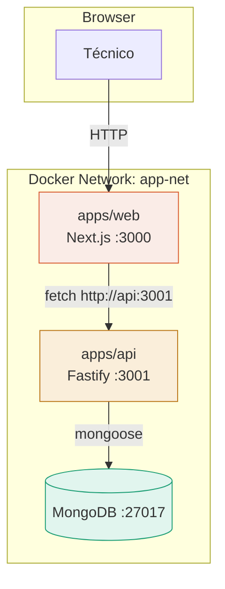
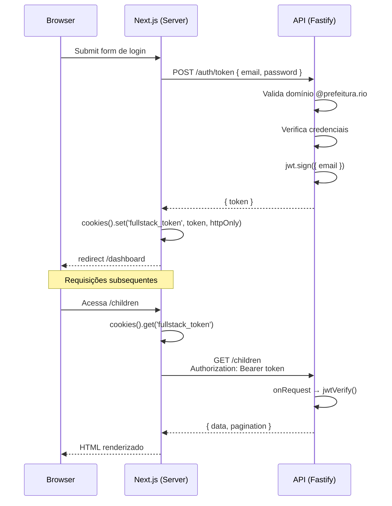
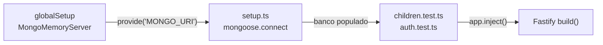

# Painel de Gestão Social

A Prefeitura acompanha crianças em situação de vulnerabilidade social cruzando informações de três áreas: saúde, educação e assistência social. Os técnicos de campo precisam de um painel para identificar rapidamente quais crianças têm alertas ativos — vacinas atrasadas, frequência escolar baixa, benefícios suspensos — e registrar o acompanhamento realizado.

> Desafio fullstack · Next.js 16 + Fastify + MongoDB · Docker Compose

**Credenciais de teste:**
```
email: tecnico@prefeitura.rio
senha: painel@2024
```

<!-- TODO: adicionar screenshots -->
<!--  -->
<!--  -->
<!--  -->

---

## Como rodar

### Pré-requisitos

- Docker Desktop e Docker Compose
- Git

### Subindo o projeto do zero

```bash
git clone https://github.com/marcmec/fullstack.git
cd fullstack
cp .env.example .env
docker compose up --build
```

Acesse:
- **Frontend:** http://localhost:3000
- **API:** http://localhost:3001

O `docker compose` sobe três containers (web, api, mongo), cria a rede interna, executa o seed automaticamente com 25 registros e disponibiliza tudo pronto para uso.

### Desenvolvimento local

```bash
# subir só o MongoDB
docker compose up mongo -d

# API com hot reload
cd apps/api
cp .env.example .env
npm install
npm run dev

# Frontend com hot reload (outro terminal)
cd apps/web
npm install
npm run dev
```

### Rodando os testes

```bash
cd apps/api
npm test
```

15 testes passando — 8 de rotas CRUD e 7 de autenticação.

---

## Stack

| Camada | Tecnologia | Justificativa |
|---|---|---|
| Frontend | Next.js 16 (App Router) + TypeScript | SSR nativo, Server Components, Server Actions |
| UI | Tailwind CSS v4 + shadcn/ui + Radix | Componentes acessíveis, tema customizável, sem lock-in |
| Backend | Fastify 5 + TypeScript | Performance 2-3x superior ao Express, TypeScript nativo, validação JSON Schema embutida |
| Banco | MongoDB 7 + Mongoose | Schema flexível para campos opcionais (saúde/educação/assistência podem ser null) |
| Auth | JWT com @fastify/jwt | Stateless, padrão para APIs consumidas por SPAs |
| Validação | Zod (frontend) + ajv-formats (backend) | Validação em ambas as pontas com tipagem inferida |
| Testes | Vitest + mongodb-memory-server | Velocidade, TypeScript nativo, banco isolado por execução |
| Infra | Docker + Docker Compose | Ambiente reproduzível — `docker compose up` sobe tudo |
| Monorepo | npm workspaces | Compartilha tipos entre frontend e backend via @fullstack/types |

---

## Arquitetura



Os três containers se comunicam pela rede `app-net`. O frontend resolve `api` pelo nome do serviço Docker — por isso `API_URL=http://api:3001` dentro do container e `NEXT_PUBLIC_API_URL=http://localhost:3001` no browser.

### Fluxo de autenticação



O token JWT é armazenado em cookie httpOnly — JavaScript no browser nunca acessa o token diretamente. Isso elimina XSS como vetor de roubo de credenciais. O `revisado_por` no PATCH vem do payload do token, não do body — o cliente não pode forjar quem revisou.

### Fluxo de testes



O `globalSetup` sobe um MongoDB em memória e compartilha a URI via `provide/inject` do Vitest. Cada arquivo de teste recebe um banco limpo e populado com os 25 registros do seed real.

---

## Estrutura do projeto

```
fullstack/
├── apps/
│   ├── api/                          # Fastify + Mongoose
│   │   ├── src/
│   │   │   ├── plugins/              # mongo.ts, auth.ts (fastify-plugin)
│   │   │   ├── routes/               # children.ts, auth.ts
│   │   │   ├── models/               # Children.ts (Mongoose schema)
│   │   │   ├── scripts/              # seed.ts + data/seed.json
│   │   │   ├── test/                 # globalSetup, setup, *.test.ts
│   │   │   ├── app.ts                # build() — instância reutilizável
│   │   │   └── index.ts              # server.listen()
│   │   └── Dockerfile
│   └── web/                          # Next.js 16 (App Router)
│       ├── src/
│       │   ├── app/
│       │   │   ├── (auth)/login/     # rota pública
│       │   │   └── (private)/        # rotas protegidas
│       │   │       ├── dashboard/
│       │   │       └── children/
│       │   ├── features/             # feature-based architecture
│       │   │   ├── auth/             # schema, actions, LoginForm
│       │   │   ├── children/         # table, filters, detail, review
│       │   │   ├── dashboard/        # stats, radar, critical cases
│       │   │   └── shared/           # TopBar, UserMenu, NavLink
│       │   ├── components/ui/        # shadcn/ui (copiados, não dependência)
│       │   ├── services/             # authServices, childrenServices
│       │   ├── lib/                  # api.ts, auth.ts, utils.ts
│       │   └── proxy.ts             # proteção de rotas (Next 16)
│       └── Dockerfile
├── packages/
│   └── types/                        # @fullstack/types compartilhado
│       ├── Crianca.ts
│       ├── api.ts                    # PaginatedResponse, Summary, Filters
│       └── index.ts
├── docker-compose.yml
├── .env.example
└── README.md
```

---

## Endpoints da API

| Método | Rota | Auth | Descrição |
|---|---|---|---|
| GET | `/health` | — | Status do servidor |
| POST | `/auth/token` | — | Login, retorna JWT (8h) |
| GET | `/children` | JWT | Lista crianças com filtros e paginação |
| GET | `/children/:id` | JWT | Detalhe completo de uma criança |
| PATCH | `/children/:id/review` | JWT | Marca caso como revisado |
| GET | `/stats` | JWT | Métricas agregadas para dashboard |

Todas as rotas (exceto `/health` e `/auth/token`) exigem JWT. A spec original protegia apenas o PATCH, mas optei por proteger tudo — dados pessoais de menores em situação de vulnerabilidade não podem ficar publicamente acessíveis (LGPD).

### Filtros do GET /children

```
?bairro=Rocinha
?alerta=vacinas_atrasadas
?revisado=true
?page=1&limit=15
```

### Validação do POST /auth/token

| Cenário | Status | Motivo |
|---|---|---|
| Email malformado | 400 | JSON Schema com `format: email` (ajv-formats) |
| Campos faltando | 400 | `required: ['email', 'password']` |
| Domínio errado | 403 | Apenas `@prefeitura.rio` permitido |
| Credenciais inválidas | 401 | Email ou senha não conferem |
| Válido | 200 | Retorna `{ token }` |

---

## Testes

```bash
cd apps/api
npm test
# 15 testes passando
```

### children.test.ts — 8 testes

- Listagem completa retornando 25 registros
- Filtro por bairro
- Filtro por alerta (vacinas_atrasadas)
- Filtro por status revisado
- Paginação (page + limit)
- Detalhe por ID
- 404 para ID inexistente
- Contagens corretas no aggregate (/stats)

### auth.test.ts — 10 testes

- Login com credenciais válidas retorna token
- 401 com senha inválida
- 403 com domínio fora de @prefeitura.rio
- 400 com email malformado
- 400 sem email
- 400 sem password
- PATCH 401 sem token
- PATCH 401 com token forjado
- PATCH 200 com token válido (marca revisado)
- PATCH 404 com token válido e ID inexistente

---

## Decisões técnicas

### Por que Fastify e não Express

Optei pelo Fastify por ter uma documentação bem organizada e performance superior ao Express. O sistema de plugins com `fastify-plugin` permitiu separar concerns (mongo, auth) de forma limpa. A validação JSON Schema embutida evitou dependências externas para validação de body.

### Por que MongoDB e não SQL

Os dados têm campos opcionais por natureza — uma criança pode não ter registro de saúde, educação ou assistência social. No MongoDB o documento aninhado representa isso naturalmente. Fiquei mais confortável com a curva de aprendizado do NoSQL para essa tarefa.

### Por que JWT e não Sessions

API REST consumida por SPA — JWT é o padrão. Sessions exigiriam Redis no compose. JWT mantém a arquitetura stateless e escala horizontalmente sem infraestrutura adicional.

### Por que monorepo com workspaces

A interface `Crianca` e os tipos de resposta da API são compartilhados entre frontend e backend. Com `npm workspaces`, ambos importam de `@fullstack/types` — single source of truth.

### Por que `app.ts` separado de `index.ts`

A função `build()` retorna a instância Fastify sem chamar `listen()`. Os testes usam `app.inject()` para fazer requisições simuladas sem porta real. Padrão oficial documentado em fastify.dev.

### Por que proteger todas as rotas

A spec marca apenas o PATCH como protegido, mas optei por proteger todos os endpoints. Dados pessoais de menores em situação de vulnerabilidade não podem ficar acessíveis sem autenticação — é requisito básico de LGPD.

### Por que cookie httpOnly e não localStorage

O token JWT é armazenado em cookie httpOnly — imune a XSS. Server Components do Next.js leem o cookie direto no servidor, sem expor o token ao JavaScript do browser.

### Por que feature-based architecture

Organizei o frontend por features de negócio (`auth/`, `children/`, `dashboard/`) em vez de tipo de componente (atomic design). Tudo que pertence a uma feature fica junto — quando preciso mudar algo, abro uma pasta só.

### Por que Server Actions para mutations

Login e revisão de caso usam Server Actions (Next 14+). O token nunca sai do servidor, a função roda no Node, e o `revalidatePath` invalida o cache automaticamente.

### Por que Aggregation Pipeline no /stats

Uma única query no banco com `$group` + `$project` retorna todas as métricas. Alternativa seria 8 `countDocuments` separados — mais lento e com risco de inconsistência entre counts.

---

## O que faria diferente com mais tempo

**Endpoint `/me` para dados do usuário.** Hoje decodifico o JWT no frontend para mostrar o email na topbar. Com mais dados de usuário (nome, role, foto), criaria um endpoint dedicado.

**Endpoint `/children/critical` com aggregation.** A lista de casos críticos no dashboard é calculada no frontend (filter + sort em memória). Funciona para 25 registros. Em produção, moveria para uma aggregation pipeline no MongoDB com endpoint dedicado.

**Endpoint `/children/bairros` para filtros dinâmicos.** Hoje busco todos os registros e extraio bairros únicos no frontend. Com volume maior, seria uma query `distinct` no banco.

**Formulário de revisão expandido.** O PATCH atual só marca `revisado=true`. Seria mais útil permitir que o técnico atualize dados da criança — por exemplo, confirmar matrícula escolar verificada em visita.

**Histórico de alterações e visitas.** Logs de quem alterou o quê e quando. Histórico de visitas ajuda a contextualizar cada caso e facilita a atuação de outros técnicos.

**Mapa geográfico interativo.** Heatmap com localização dos casos críticos usando Leaflet + OpenStreetMap. Não implementei porque dependeria de coordenadas no dataset e exigiria considerações de LGPD para dados de menores.

**Virtualização da lista em mobile.** Para datasets maiores, implementaria virtualization (react-window) na lista de crianças em viewport mobile.

**Refresh token + invalidação.** O JWT expira em 8h sem refresh. Implementaria refresh tokens em cookie httpOnly e blacklist no Redis para invalidar tokens comprometidos.

**Testes E2E com Playwright.** Os testes atuais cobrem a API integrada ao banco. Playwright validaria o fluxo completo no browser: login → dashboard → filtros → revisão.

**CI/CD com GitHub Actions.** Pipeline rodando lint, build e testes a cada PR, com deploy automático para staging.

---

## Variáveis de ambiente

Veja `.env.example` para a lista completa.

| Variável | Onde | Descrição |
|---|---|---|
| `JWT_SECRET` | `.env` raiz e `apps/api/.env` | Chave para assinar tokens |
| `MONGO_URL` | docker-compose.yml | URL do MongoDB na rede Docker |
| `API_URL` | docker-compose.yml | URL da API para Server Components |
| `NEXT_PUBLIC_API_URL` | docker-compose.yml | URL da API para o browser |

Para gerar uma chave JWT segura:
```bash
node -e "console.log(require('crypto').randomBytes(64).toString('hex'))"
```

---

## Uso de IA no desenvolvimento

Utilizei o Claude (Anthropic) via chat como ferramenta de consulta durante o desenvolvimento. O uso se dividiu em:

**Consultas técnicas e correções** — tirar dúvidas sobre configurações do Vitest com mongodb-memory-server, resolver conflitos de tipagem entre Fastify e ajv-formats, debugar problemas de Docker networking (containers se comunicando pela rede interna), e revisar decisões de arquitetura como a separação de `app.ts` e `index.ts` para testabilidade.

**Aceleração com presets** — em alguns momentos reutilizei trechos sugeridos para agilizar a entrega, especialmente em configuração de infraestrutura (Dockerfiles multi-stage, globalSetup do Vitest, configuração do shadcn/ui com Tailwind v4). Todo código foi revisado e adaptado antes de ser incorporado.

**Documentação** — o README e os diagramas Mermaid foram construídos em colaboração. A IA ajudou a estruturar a documentação e eu reescrevi com minhas palavras e decisões.

**Diagramas de arquitetura** — com as sugestões de diagramas em Mermaid, pude explanar melhor minhas decisões de trade-off e tornar a documentação mais visual e acessível para quem for avaliar o projeto.

**O que não deleguei:** todas as decisões arquiteturais são minhas — escolha de stack, estrutura de pastas, separação de features, proteção de rotas por LGPD, e o design visual do painel. O código foi escrito e revisado por mim, com a IA servindo como par de consulta.

---

## Autor

**Marcos Vinícius Silva Bento** — Full-Stack Developer

[GitHub](https://github.com/marcmec) · [LinkedIn](https://linkedin.com/in/marcmec)